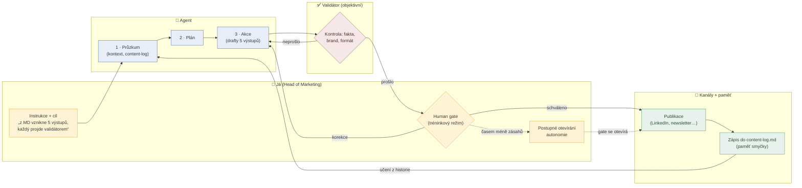

# Flow — Loop Engineering (marketingová automatika)

> Swimlane diagram funkčního řešení: dráhy = kdo/co daný krok dělá.
> Otázka, na kterou odpovídá: „Jak systém funguje a kdo vlastní který krok?"
> Generuje agent z KONTEXT.md a prvni-30-dnu.md. Poslední update: 12. 7. 2026

