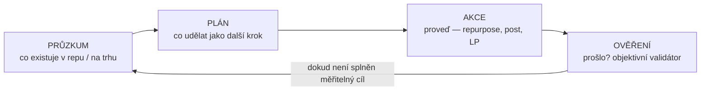
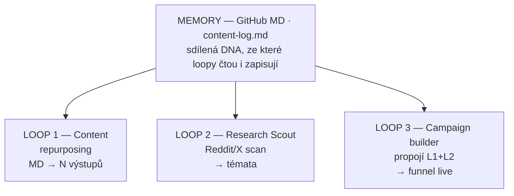
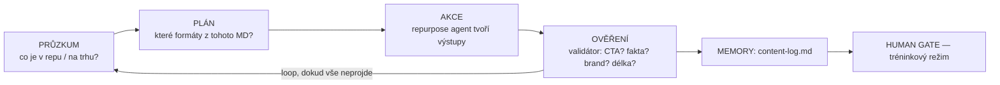
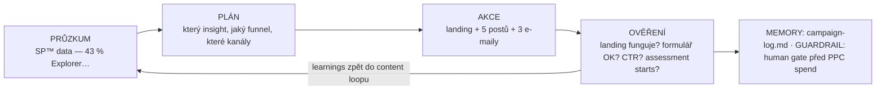
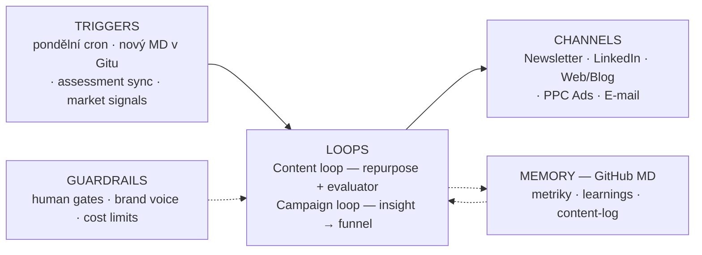

# Prvních 30 dní: Head of Marketing @ Aibility

> Návrh, jak bych rozjel AI-first marketing — od auditu po první měřitelnou kampaň.
> Postaveno z veřejných zdrojů (web, kariérní stránka, produktové stránky, veřejný obsah týmu).

**Vize (jak dál):** Stavím si automatiku nad vlastním druhým mozkem — a chci postavit **marketingovou automatiku nad celým Aibility**:

- **Cíl místo instrukce:** ne „napiš post", ale „z jednoho MD vznikne 5 výstupů a každý projde validátorem"
- **Smyčka:** průzkum → plán → akce → ověření (objektivní validátor, ne „líbí se mi to?")
- **Paměť:** GitHub + markdown jako knowledge base (content-log)
- **Tréninkový režim:** human gate na začátku → postupná autonomie

Prvních 30 dní je konkrétní start téhle vize:

---

## Filozofie: Loop Engineering pro marketing

Inspirace: [Marek Bartoš / Colbrain](https://www.youtube.com/watch?v=DvqGkGqjTHo) · [Addy Osmani](https://addyosmani.com/blog/loop-engineering/) · vaše vlastní praxe (*„každé pondělí ráno scrape webu, vytvoří 14 postů, naplánuje a samy se postují"* — Anetin setup Cursor + Upload-Post, který našel Tom; viděl jsem v [AI Morning Show 4. 2.](https://www.youtube.com/watch?v=Tk90j9peezg) a na [vašem blogu](https://aibility.org/blog/jak-v-aibility-pracujeme-s-ai)).

### Problém: ping-pong s AI

Když řešíte složitější marketing (kampaň, content engine, funnel), klasický promptovací ping-pong drhne: AI něco udělá → vy najdete chybu → opravíte → znovu → až do soudného dne. Jste **mikro-manažer stážisty**, kterému stojíte za zády a schvalujete každou větu. Tím, že každý krok ručně kontrolujete, škrtíte výkon AI na rychlost vašeho psaní.

**Posun role:** Z mikro-manažera jednotlivých promptů → **strategický architekt** autonomních systémů.

> *„Já už Claudovi nepíšu prompty. Moje práce je psát smyčky."* — Boris Cherny, Anthropic

Nejste ten, kdo ručně posouvá každou kostku. Jste ten, kdo rozhoduje, **kde celá stavba bude stát** — definuje cíle, validátory, paměť a guardrails. A na rozdíl od stroje přinášíte to, co AI nemá: vkus, judgment, brand — věci, které nejdou změřit testem.

### Instrukce vs. cíl

| Instrukce (prompt engineering) | Cíl (loop engineering) |
|-------------------------------|------------------------|
| „Napiš LinkedIn post o AI Explorer" | „Z tohoto MD vznikne 5 výstupů ve frontě ke schválení, každý splní validátor" |
| Jeden krok, jeden výstup | Systém běží, dokud cíl není splněn |
| Vy jste smyčka | Vy navrhujete smyčku |

### 4 kroky každé smyčky

Každý marketingový loop u Aibility běží ve stejném rytmu:



**Ověření ≠ „vypadá to dobře?"** AI má sklon vlastní práci hodnotit příznivě. Skutečný validátor je objektivní: ano/ne.

Příklady validátorů pro marketing:
- Obsahuje CTA na assessment? ✓/✗
- Fakta odpovídají zdrojovému MD? ✓/✗
- Žádné zakázané fráze z brand voice skill? ✓/✗
- Landing page se načte, formulář funguje? ✓/✗
- Kampaň: assessment starts ≥ X/týden? ✓/✗

### Architektura: paměť + paralelní loopy

**Sdílená paměť** = GitHub markdown (vaše DNA). Digitální tabule, ze které všechny loopy čtou a zapisují — co šlo ven, co fungovalo, co se neopakuje.



*(Inspirace: paralelní agenti z videa — jeden staví quiz, druhý skenuje trendy, třetí propojí do kampaně. U vás už Research Scout existuje.)*

### Tréninkový režim → plná autonomie

Novou smyčku nikdy nenechám bez dozoru hned na začátku:

1. **Týden 1–2:** Loop plánuje → provede → ověří → **čeká na můj souhlas** před publikací
2. **Týden 3–4:** Ověřím validátory na reálných datech → postupně uvolním gate
3. **Měsíc 2+:** Loopy běží na pozadí, já schvaluji jen výjimky a strategické rozhodnutí

### Moje role v systému

| Co dělám já (architekt) | Co dělá loop (autonomní síla) |
|-------------------------|-------------------------------|
| Definuji měřitelné cíle | Průzkum → plán → akce → ověření |
| Navrhuji validátory | Iteruje, dokud neprojde testem |
| Stavím paměť a nástroje (MCP, GitHub, analytics) | Zapisuje průběh, neopakuje chyby |
| Schvaluji v tréninkovém režimu | Běží na pozadí, hlásí se jen když hotovo |
| **Vkus, brand, positioning** — věci, které nejdou změřit | Exekuce toho, co *jde* změřit |

**Můj job:** Nestavět obsah. Stavět loopy, které obsah staví — a zůstat člověkem, který rozumí tomu, co systém produkuje.

---

## Diagnóza (co vidím zvenku)

Aibility má něco, co většina AI vzdělávacích firem nemá: **reálná data a příběhy**.

| Asset | Potenciál |
|-------|-----------|
| SP™ Assessment + 3 000+ respondentů | Lead magnet, PR, thought leadership („Stav AI v ČR") |
| 12+ klientských příběhů na webu | Repurposing na LinkedIn, newsletter, case studies |
| Filip Dřímalka + osobní brand | Amplifikace, ne závislost |
| Webináře, kurzy, přepisy | Content engine — 1 zdroj → N výstupů |
| B2B klienti (NN, O2, Seyfor…) | Social proof, ABM kampaně |
| EU AI Act compliance angle | B2B hook pro management |

**Mezera:** Obsah existuje, ale **marketingové loopy** — systémy, které obsah nacházejí, zpracovávají, ověřují a publikují bez ručního řízení každého kroku — zatím nejsou zvenku vidět jako celek. Částečně už u vás běží (pondělní posty). Moje role: z toho udělat architekturu, ne sbírku jednotlivých hacků.

---

## Cíl prvního měsíce

Na konci 30 dní chci mít:

1. ✅ **Běžící content rytmus** — min. 2 newslettery, 8+ postů, 1 lead magnet
2. ✅ **Marketing loop v0.1** — alespoň 1 end-to-end loop (trigger → výstup → evaluace → paměť)
3. ✅ **Content engine dokumentovaný** — pipeline v markdownu na GitHubu (GitHub-ready)
4. ✅ **První kampaň s čísly** — landing page, e-mail sequence, základní metriky
5. ✅ **Marketing dashboard** — přehled kanálů, konverzí, top obsahu + co se vrací do loopu

---

## Týden 1: Naslouchat, mapovat, první loop

### Den 1–2: Audit + mapa loopů (ne jen obsahu)
- Projdu veškerý veřejný i interní obsah: web, newsletter archiv, sociální sítě, kurzy, assessment flow
- **Mapa existujících loopů:** co už běží automaticky? (pondělní posty přes Cursor + Upload-Post, webinář → MD sync, Research Scout…)
- Mapa obsahových assetů: co existuje, kde žije, jak se dá repurposovat
- Projdu assessment data — jaké insighty jdou ven (anonymizovaně)
- Konkurenční scan: kdo v ČR/SK dělá AI vzdělávání, kde je mezera v positioning

**Výstup:** `content-audit.md` + `loop-inventory.md` — co běží, co chybí, kde jsou mezery

### Den 3–4: Quick wins ven + první mini-loop (tréninkový režim)
- Z 3 klientských příběhů z webu → 3 LinkedIn posty (ručně — abych měl benchmark pro validátor)
- 1 newsletter issue z existujícího obsahu (ne nový research — rychlý ship)
- **Postavím první mini-loop v tréninkovém režimu:**
  - **Cíl (ne instrukce):** „Z nového MD v repu vzniknou 3 drafty postů ve frontě, každý projde validátorem"
  - **Validátor:** CTA přítomno? Fakta = zdrojové MD? Žádné zakázané fráze?
  - **Paměť:** `content-log.md` — co zpracováno, co čeká
  - **Human gate:** schvaluji každý cyklus (tréninkový režim)
- Navrhnu positioning statement pro Q3 (1 strana, ne 30)

### Den 5: Sync s týmem
- 60 min s Filipem/Tomem/Martinem/Žanetou: co funguje, co ne, co je off-limits
- Validace: které loopy už běží? Kde jsou guardrails? Co smí jít ven bez schválení?
- Validace priorit: B2C assessment vs. B2B adopce — kam tečou peníze a energie

**Metriky týdne 1:** 3 posty live, 1 newsletter draft, audit hotový, 1 loop prototyp dokumentovaný

---

## Týden 2: Content loop v0.1

### Princip: cíl, ne instrukce

Špatně: *„Napiš mi post z tohoto webináře."*
Správně: *„Z každého nového MD v repu vznikne 5 výstupů ve frontě. Každý projde objektivním validátorem. Nezastavuj se, dokud validátor neřekne ano u všech."*



### Co postavím (architektura, ne jednotlivé posty)
1. **Brand voice skill** (`SKILL.md`) — tone, zakázaná slova, příklady (vstup pro validátor)
2. **Objektivní validátor** — checklist ano/ne, ne „vypadá to dobře?"
3. **Repurpose loop** — 4 kroky: průzkum MD → plán formátů → akce → ověření
4. **Paměť** — `content-log.md`: kapitánův deník (co šlo ven, co nefungovalo, co neopakovat)
5. **Nástroje (MCP/connectors):** přístup k GitHubu, analytics, newsletter tool — loop potřebuje ruce. Publikaci navážu na váš stávající Upload-Post; kdyby přestal stačit (validátor ve smyčce, video, další sítě), plán B je **Postiz** nebo **Blotato** — obojí ovladatelné agentem přes MCP/API. Buffer vynechávám — vím, že vás zklamal.
6. **Video větev (základ pro M2):** repurposing nejen na text — z nahrávek webinářů a eventů **YouTube Shorts**. Ne nativní tvorba Shorts, ale stejná smyčka nad obsahem, který už vzniká.

### Evaluator ≠ „líbí se mi to?"
AI si vždycky vlastní práci ohodnotí na jedničku. Proto:
- **Maker agent** tvoří výstupy
- **Validátor** (oddělený checklist / druhý agent) měří objektivně: fakta, CTA, brand voice, technická funkčnost
- **Já** schvaluji v tréninkovém režimu — dokud validátor nechytá reálné chyby spolehlivě

### Newsletter rytmus
- Navrhnu frekvenci (týdně / 2× měsíčně) na základě audit + kapacity týmu
- Template jako skill: 1 insight z dat + 1 příběh + 1 praktický tip + 1 CTA na assessment

**Metriky týdne 2:** loop dokumentovaný a spuštěný 1× end-to-end, 2. newsletter live, 4+ posty

---

## Týden 3: Kampaň jako loop (ne jednorázový projekt)

### Kampaň: „Kolik % vašeho týmu je AI Explorer?"

**Proč tato kampaň:**
- Využívá unikátní SP™ data (43 % Explorer, 12 % Builder…)
- Assessment je vstupní produkt (kvíz zdarma → plný profil 490 Kč) i B2B door opener
- Diferenciace: ne „naučte se ChatGPT", ale „změřte, kde jste"

**Kampaň jako loop** s měřitelným cílem:

| Špatně (instrukce) | Správně (cíl) |
|--------------------|---------------|
| „Udělej poutavou kampaň o AI Explorer" | „Assessment starts ≥ 50/týden z LinkedIn trafficu, landing konverze ≥ 8 %" |



**Paralelní loopy (M2 preview):** Zatímco kampaň běží, Research Scout loop skenuje trendy → témata pro další iteraci. Sdílená paměť = GitHub MD.

**Funnel:**
```
LinkedIn post s datovým insightem
    ↓
Landing page: „Zjistěte, kde je váš tým" (B2B) / „Zjistěte svůj AI profil" (B2C)
    ↓
SP™ Assessment (kvíz zdarma, plný profil 490 Kč)
    ↓
E-mail sequence (3 e-maily): výsledky → tipy → kurz/foundations
    ↓
Retargeting (PPC agentura — brief připravím)
```

**Co dodám:**
- Landing page (vibecoded, v identitě Aibility)
- 3 e-maily v sekvenci
- 5 variant LinkedIn postů pro A/B (evaluator pattern)
- Brief pro PPC agenturu s KPIs — řízení agentury (brief, podklady, kontrola) + agent, který podklady generuje a výstupy agentury proti KPIs kontroluje
- **Loop spec:** co se spouští znovu, když přijdou nová assessment data

**Metriky týdne 3:** kampaň live, první data (impressions, CTR, assessment starts), learnings zapsané do memory

---

## Týden 4: Metriky, paměť, iterace loopů

### Marketing dashboard v0.1
Jednoduchý přehled (klidně Vercel + data z analytics):
- Traffic po kanálech
- Assessment konverze (start → dokončení → platba)
- Top 5 obsahů za měsíc
- Newsletter open/click rate
- B2B leady (formulář / call bookings)
- **Loop health:** kolik výstupů šlo přes automatizaci vs. ručně

### Dokumentace pro tým (architektura, ne návod pro operátora)
- `marketing-loops.md` — přehled běžících loopů (trigger, goal, guardrails)
- `marketing-playbook.md` — jak přidat nový zdroj do content loopu
- `campaign-retro.md` — co fungovalo, co ne, co příště → **zpět do memory**
- Aktualizace knowledge base na GitHubu

### Sync + plán na měsíc 2
- 30min retro s Filipem: čísla, learnings, které loopy škálovat
- **Rozhodnutí:** které loopy můžu pustit ze řetězu (validátory fungují → méně human gates)
- Návrh měsíce 2: paralelní loopy (Research Scout + content + kampaň), škálování

**Metriky týdne 4:** dashboard live, retro hotové, plán M2, min. 2 loopy dokumentované, 1 loop připravený jako kandidát na vyšší autonomii (HITL — na začátku více, postupně méně)

---

## Systém, který chci postavit (za 90 dní, ale základy v M1)



*Moje role: strategický architekt loopů — ne operátor každého kroku.*

### Roadmap loopů (M1 → M3)

| Loop | Trigger | Goal | Měsíc |
|------|---------|------|-------|
| Content repurposing | Nový MD v repu | N výstupů ve frontě ke schválení | M1 |
| Kampaň AI Explorer | Datový insight | Assessment starts | M1 |
| Pondělní social batch (navazuje na váš Upload-Post setup) | Cron (pondělí 8:00) | 14 postů naplánováno | M2 |
| Video repurposing — YouTube Shorts z webinářů a eventů | Nová nahrávka | N Shorts ve frontě ke schválení | M2 |
| Assessment insights | Nová data v benchmarku | 1 datový post + newsletter snippet | M2 |
| Research Scout → content | Týdenní report | Témata pro editorial | M3 |

---

*Inspirace: Loop Engineering — Marek Bartoš (Colbrain), Boris Cherny, Addy Osmani. Aplikováno na marketing Aibility.*
